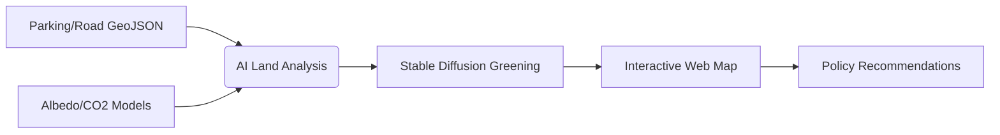

# forest-vision-dashboard

# GreenPlanner 🌿  
**AI-Driven Urban Greening & Climate Resilience Platform**  
*Repurposing parking lots and roads for a cooler, greener San Francisco.*  

---

### **Problem Statement**  
Urban areas like San Francisco waste **~20% of land** on parking and roads, while rising temperatures from asphalt-dominated landscapes worsen climate impacts. Autonomous vehicles (AVs) could free 55–60% of this space—but cities lack tools to visualize, plan, and prioritize green conversions equitably.  

---

### **Solution**  
GreenPlanner combines **AI**, **satellite mapping**, and **policy-aware simulations** to:  
1. **Identify** underutilized parking/road areas ripe for greening.  
2. **Simulate** climate impact (albedo gain, CO2 reduction) of urban forests, green roofs, etc.  
3. **Visualize** transformations via AI-generated "solarpunk" imagery.  

---

### **Key Features**  
- 🗺️ **Interactive Map**: Highlight SF parking lots/roads with AV-induced reuse potential.  
- 🌳 **AI Greening Engine**: Stable Diffusion pipeline overlays vegetation on satellite images.  
- 📊 **Policy Dashboard**: Equity-focused metrics to prioritize low-income neighborhoods.  
- 🔄 **Impact Modeling**: Estimate CO2 sequestration and heat reduction per project.  

---

### **How It Works**  


---

### **Quickstart (10-Minute Hackathon Setup)**  
```bash  
git clone https://github.com/your-repo/greenplanner  
cd greenplanner  
pip install -r requirements.txt  # Flask, OpenCV, Replicate  
```  
1. **Get API Keys**:  
   - [Mapbox](https://www.mapbox.com/)  
   - [Replicate (SDXL)](https://replicate.com/)  
2. Run:  
```bash  
python app.py  # Frontend: http://localhost:5000  
```  

---

### **Data Sources**  
| Type                | Simple (Hackathon)          | Advanced (Production)       |  
|---------------------|-----------------------------|------------------------------|  
| **Parking Lots**    | SF OpenData GeoJSON         | Live parking APIs (SFMTA)    |  
| **Satellite Imagery** | Mapbox Static Tiles        | Maxar 30cm/drone imagery     |  
| **Climate Metrics**  | Mock albedo/CO2 tables     | NASA/MODIS + WRF microclimates |  

---

### **AI Components**  
- **Stable Diffusion**: `stability-ai/sdxl` for solarpunk visuals ([Replicate](https://replicate.com/stability-ai/sdxl)).  
- **Policy Engine**: Rules-based prioritization (e.g., `if income < threshold: plant_trees()`).  
```python  
# Example: CO2 impact calculator  
def co2_impact(area):  
    return area * 0.6 * 22  # 60% conversion, 22kg/tree/year  
```  

---

### **Contributors**  
| Role                | Tools                          |  
|---------------------|--------------------------------|  
| Frontend Engineer   | React, Mapbox                  |  
| Backend/Data        | Flask, OpenCV, Python          |  
| AI/Visualization    | Stable Diffusion, Replicate   |  
| Project Lead        | Storytelling, Stakeholder QA  |  

---

### **Next Steps**  
- **Phase 1**: Mission District MVP (1 sq mile).  
- **Phase 2**: Gamify citizen input ("Adopt a Virtual Tree").  
- **Phase 3**: City partnerships for live data/policy integration.  

--- 

[](https://opensource.org/licenses/MIT)  
**Contact**: [ami.yx.zou@gmail.com](mailto:ami.yx.zou@gmail.com) | [@SFClimateHacks](https://twitter.com/SFClimateHacks)  
``` 

---

### **README Sections Summary**  
Copy-paste this into a `README.md` to onboard collaborators, partners, or judges. Includes:  
1. **Problem/Solution**: Why this matters.  
2. **Tech Stack**: Transparent toolchain for reproducibility.  
3. **Quickstart**: Fast setup for hackathons.  
4. **Impact Metrics**: CO2/albedo projections.  
5. **Roadmap**: Scalability beyond SF.  

Ideal for climate hackathon submissions or GitHub/GitLab repos! 🌍✨

Running the backend

```
cd backend
pip install requirements.txt
```
